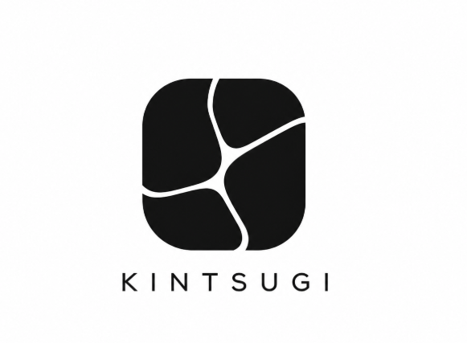

<div align="center">
  
  <h1>KintsugiBot</h1>
  <p><strong>Autonomous bug-fixing bot for GitHub repositories.</strong></p>
  <p>KintsugiBot investigates issues, traces root causes, writes fixes, runs tests, and opens pull requests — automatically.</p>
  <br/>
  <a href="https://github.com/marketplace/kintsugibot"></a>
</div>

---

## What it does

When an issue is opened on your repository, KintsugiBot:

1. **Classifies** the issue — skips feature requests and support questions automatically
2. **Investigates** — reads relevant files, traces imports, searches the codebase, checks git history
3. **Fixes** — edits code at the root cause, writes a regression test
4. **Verifies** — runs your existing test suite to confirm nothing is broken
5. **Opens a PR** — high-confidence fixes get a ready-to-merge PR; lower-confidence fixes get a draft for your review

If the issue is already resolved in the codebase, it posts a comment saying so and suggests closing it.

---

## Plans

| Plan | Price      | Issues / month | Repos     | Private repos |
| ---- | ---------- | -------------- | --------- | ------------- |
| Free | $0         | 10             | Unlimited | Public only   |
| Paid | $5 / month | 100            | Up to 10  | Yes           |

---

## Installation

1. Install KintsugiBot from the [GitHub Marketplace](https://github.com/marketplace/kintsugibot)
2. Grant access to the repositories you want it to watch
3. Open (or re-open) an issue — KintsugiBot responds automatically

No configuration files or code changes needed. It auto-detects your language, runtime, and test framework.

---

## How it works

```
GitHub Issue opened
        │
        ▼
  Webhook Server
        │
        ▼
  BullMQ Queue ──► Redis
        │
        ▼
  Issue Worker
        │
        ├── LLM agent loop (up to 40 iterations)
        │         │
        │         ├── read_file, search_codebase, find_symbol ...
        │         ├── run_command, run_tests, get_diff ...
        │         └── patch_file, write_file, submit_fix ...
        │
        ├── E2B Cloud Sandbox (isolated, ephemeral)
        │
        └── GitHub API (PR creation, comments, CI checks)
```

All code execution happens in a secure, isolated cloud sandbox via [E2B](https://e2b.dev). The sandbox is destroyed immediately after each job — your code never persists outside the run.

---

## Confidence scoring

KintsugiBot won't open a PR unless it's confident the fix is correct:

| Score     | Action                                                           |
| --------- | ---------------------------------------------------------------- |
| **≥ 85**  | Opens a ready-to-merge PR, labeled `bot-fix` + `high-confidence` |
| **50–84** | Opens a draft PR for human review, labeled `bot-fix`             |
| **< 50**  | Posts a detailed analysis comment — no PR                        |

---

## Triggering the bot

KintsugiBot triggers on two events:

1. **Issue opened** — runs automatically on every new issue
2. **`bot-fix` label added** — re-triggers on an existing issue (useful after a failed run)

---

## Supported languages

| Language             | Test runner            |
| -------------------- | ---------------------- |
| Node.js / TypeScript | Jest, Vitest, Mocha    |
| Python               | pytest                 |
| Go                   | go test                |
| Rust                 | cargo test             |
| Ruby                 | RSpec                  |
| PHP                  | PHPUnit                |
| Java                 | JUnit (Maven / Gradle) |
| .NET                 | dotnet test            |
| Swift                | swift test             |
| Dart                 | dart test              |
| Elixir               | mix test               |
| C / C++              | ctest / make test      |

---

## Self-hosting / Local development

You can run KintsugiBot on your own infrastructure (Fly.io, Railway, etc.) or locally for development and testing.

### Prerequisites

- **Node.js 20+** — check with `node --version`
- **npm** — comes with Node.js, check with `npm --version`
- **Redis** — used for the job queue (BullMQ)
  - [Install Redis locally](https://redis.io/docs/latest/operate/oss_and_stack/install/install-redis/) or use Docker (recommended for dev):

    ```bash
    docker compose up -d    # starts Redis on port 6379
    ```

### Setup

1. **Clone the repository:**

   ```bash
   git clone https://github.com/Suh0161/Kintsugibot.git
   cd Kintsugibot
   ```

2. **Install dependencies:**

   ```bash
   npm install
   ```

3. **Configure environment variables:**

   ```bash
   cp .env.example .env
   ```

   Then edit `.env` with your values (see [Environment variables](#environment-variables) below).

4. **Start Redis** (if not already running):

   ```bash
   docker compose up -d
   ```

5. **Run the bot:**

   ```bash
   npm run dev
   ```

   This starts both the HTTP server (webhook receiver) and the worker process with hot-reload via `tsx watch`.

### Environment variables

Copy `.env.example` to `.env` and fill in the required values. All settings are documented inside `.env.example`.

**Required:**

| Variable                      | Description                                                  |
| ----------------------------- | ------------------------------------------------------------ |
| `LLM_API_KEY`                 | Any OpenAI-compatible API key (DeepSeek, OpenAI, Groq, etc.) |
| `GITHUB_APP_ID`               | Numeric App ID from your GitHub App settings                 |
| `GITHUB_APP_PRIVATE_KEY_PATH` | Path to your GitHub App `.pem` private key file              |
| `WEBHOOK_SECRET`              | Webhook secret you chose when creating the GitHub App        |
| `REDIS_URL`                   | Redis connection string (e.g. `redis://127.0.0.1:6379`)      |
| `E2B_API_KEY`                 | API key from [E2B](https://e2b.dev) (free tier available)    |

**Optional but useful:**

| Variable             | Default                    | Description                                                     |
| -------------------- | -------------------------- | --------------------------------------------------------------- |
| `LLM_BASE_URL`       | `https://api.deepseek.com` | Base URL for the LLM API                                        |
| `LLM_MODEL`          | `deepseek-chat`            | Model name to use                                               |
| `PORT`               | `3000`                     | HTTP server port                                                |
| `RUN_MODE`           | `both`                     | `both` / `api` / `worker` — split API and worker for production |
| `WORKER_CONCURRENCY` | `2`                        | Number of issues processed in parallel                          |
| `LOG_LEVEL`          | `info`                     | `debug` / `info` / `warn` / `error`                             |

### Production deployment

```bash
npm install
npm run build
npm start        # starts the compiled dist/index.js
```

Or use the provided Dockerfile:

```bash
docker build -t kintsugibot .
docker run -p 3000:3000 --env-file .env kintsugibot
```

### Forwarding webhooks to localhost (development)

When developing locally, GitHub cannot send webhooks to `localhost`. Use [Smee.io](https://smee.io) to forward them:

1. Visit [smee.io](https://smee.io) and click **Start a new channel**
2. Copy the Smee channel URL
3. Add it to your `.env`:

   ```env
   SMEE_URL=https://smee.io/your-channel-id
   ```

4. Run the Smee client alongside the bot:

   ```bash
   npm run smee     # in a separate terminal
   npm run dev      # in another terminal
   ```

### Troubleshooting

**"Cannot connect to Redis"**

Make sure Redis is running. Test with:

```bash
redis-cli ping    # should reply PONG
```

Or start Redis via Docker:

```bash
docker compose up -d
```

**"LLM_API_KEY is missing"**

Verify `.env` exists and contains the required variables. The bot reads from `.env` automatically via `dotenv`. Ensure the file is in the project root.

**"Webhook signature verification failed"**

- Confirm `WEBHOOK_SECRET` in your `.env` matches exactly what you entered in your GitHub App settings.
- If testing locally without Smee, you can temporarily set `DEV_SKIP_WEBHOOK_SIGNATURE_VERIFY=1` (**never enable on a public URL**).

**"GitHub App private key not found"**

- Ensure `GITHUB_APP_PRIVATE_KEY_PATH` points to a valid `.pem` file, or paste the key inline as `GITHUB_APP_PRIVATE_KEY` (replace newlines with `\n`).

**"Port 3000 already in use"**

Change the port with `PORT=3001` in `.env` or stop the other process.

**"Command not found: tsx / vitest"**

Run `npm install` first. These are local dev dependencies, not global installs. Use `npx tsx` or `npx vitest` if needed.

---

## Security

- **Sandboxed execution** — all code runs in an isolated, ephemeral E2B cloud sandbox, never on the host
- **Command allowlist** — `run_command` only permits a specific set of binaries; anything else is blocked
- **Path traversal protection** — all file operations are validated to stay inside the repo root
- **Token isolation** — GitHub tokens are never written to disk or git config; only injected at push time
- **Prompt injection hardening** — issue bodies are sanitized before reaching the LLM

See [SECURITY.md](SECURITY.md) for our vulnerability disclosure policy or email [info@nvdyvette.com](mailto:info@nvdyvette.com).

---

## Contributing

See [CONTRIBUTING.md](CONTRIBUTING.md).

---

## License

[MIT](LICENSE)

---

<div align="center">
  <sub>A product of <strong>NVD Yvette</strong> · <a href="mailto:info@nvdyvette.com">info@nvdyvette.com</a> · <a href="SECURITY.md">Security Policy</a></sub>
</div>
